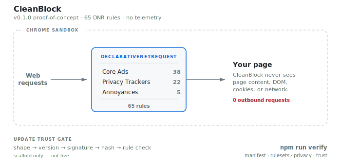

# CleanBlock

Privacy-preserving content blocker for Chrome, built on Manifest V3.


> **Proof-of-concept.** 25 static rules across 3 rulesets. A working prototype demonstrating a verifiable trust model — not a production ad blocker.

<picture>
  <source media="(prefers-color-scheme: dark)" srcset="docs/architecture-dark.svg">
  
</picture>

---

## Load in Chrome

Requires **Chrome 111+**.

1. Clone this repo
2. Open `chrome://extensions`
3. Enable **Developer Mode** (top-right toggle)
4. Click **Load unpacked** and select the repo root (the folder containing `manifest.json`)
5. Confirm no error badge on the extension card

> [!TIP]
> **Try it:** Visit a page with ads, click the CleanBlock icon in the toolbar, and check the blocked counter. Coverage is minimal — see [Limitations](#limitations).

See [LOCAL_SMOKE_TEST.md](docs/LOCAL_SMOKE_TEST.md) for a full verification checklist.

## How It Works

CleanBlock uses Chrome's `declarativeNetRequest` API to block requests at the network level. No host permissions, no content scripts, no telemetry, no build step — the source in this repo is the exact code that runs in Chrome.

| Aspect | Detail |
|--------|--------|
| **Permissions** | `storage`, `declarativeNetRequest`, `alarms` — nothing else |
| **Page access** | None — DNR rulesets operate without access to page content |
| **Telemetry** | None — nothing leaves the device |
| **Build** | None — raw source ships directly, every line is auditable |

## Trust Model

Signed updates can add, remove, or modify DNR block/allow/upgradeScheme rules. They cannot introduce JavaScript, content scripts, scriptlets, eval-like patterns, or any executable code.

Every trust claim is mechanically verifiable: `npm run verify`

Trust documentation lives in [`trust/`](trust/) — covers telemetry, allowlist, permissions, security, and build provenance.

## Limitations

> [!IMPORTANT]
> This is a v0.1.0 proof-of-concept with significant limitations.

- **25 rules total** across 3 rulesets. Production blockers ship 300k+. Most ads will not be blocked.
- **No cosmetic filtering.** Planned for v0.2 via `chrome.scripting.insertCSS()`.
- **Update pipeline is scaffold-only.** Not connected to a live endpoint.
- **No dynamic rule management UI.** The allowlist is manual.

## Verification

```
npm run verify
```

Checks manifest compliance, ruleset validity, privacy invariants, and trust surface. See [ARCHITECTURE.md](docs/ARCHITECTURE.md) for details.

## License

MIT — see [LICENSE](LICENSE).
